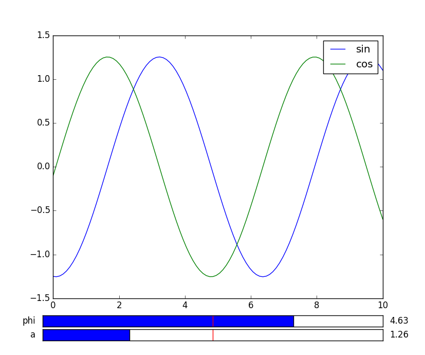
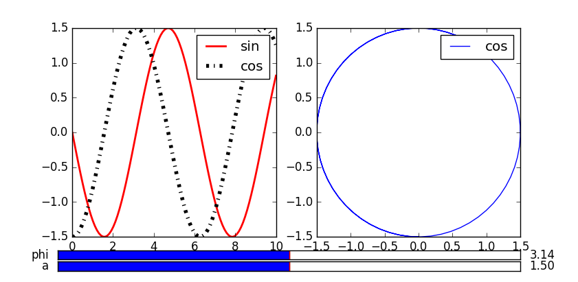

# Hello mplot

**mplot** is designed to give you a interactive manipulation 
of the parameters of the function you want.

> install
```python
python setup.py install
```

Define a function we want to show
```python
def generate(x, a, phi):
        out = np.array([x, a * np.sin(x + phi), a * np.cos(x + phi)]).T
        return pd.DataFrame(out, columns=['x', 'sin', 'cos'])
```
This function will generate sin and cos waves, and the parameters are
the amplitude and the phase, now we change these two parameters to show 
the corresponding changes of the waves.

> usage 1

We plot two waves in one picture

```python
fig = mplot(generate, np.linspace(0, 10, 100), a=(1, 2), phi=(0, 2 * np.pi))
fig.add_subplot()
fig.add_all()
fig.show()
```


> usage 2

We plot there two waves in different subplots
```python
fig = mplot(generate, np.linspace(0, 10, 100), a=(1, 2), phi=(0, 2 * np.pi))
sub1 = fig.add_subplot(121)
fig.add_line(sub1, 'x', 'sin', 'r', linewidth=2, label='sin')
fig.add_line(sub1, 'x', 'cos', 'k-.', lw=4, label='cos')
sub2 = fig.add_subplot(122)
fig.add_line(sub2, 'sin', 'cos')
fig.show()
```
